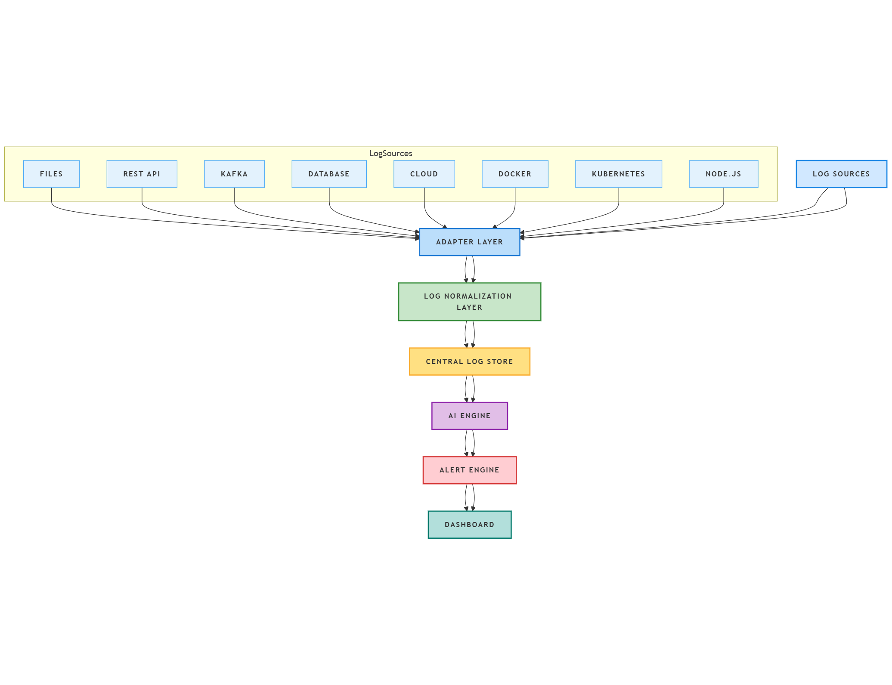

📌 Log Monitoring AI Platform

An AI-powered universal log monitoring and observability platform designed to ingest logs from multiple sources, normalize them, analyze them using intelligent models, and generate actionable alerts through a centralized dashboard.

🚀 Overview

This platform provides a scalable architecture for collecting logs from distributed systems such as:

📂 File Logs

🌐 REST APIs

📨 Kafka

🗄️ Databases

☁️ Cloud Providers

🐳 Docker Containers

📦 Kubernetes

🟢 Node.js Applications

All logs are processed through a structured pipeline that ensures consistency, scalability, and extensibility.

🏗️ Architecture

🔄 Processing Flow

Log Sources
Multiple heterogeneous systems generate logs.

Adapter Layer
Each source connects via a dedicated adapter that transforms raw logs into a unified ingestion format.

Log Normalization Layer
Converts logs into a standardized structured schema (JSON-based model).

Central Log Store
Stores normalized logs in a scalable search engine (e.g., Elasticsearch).

AI Engine
Performs:

Anomaly detection

Pattern recognition

Root cause analysis

Intelligent log clustering

Alert Engine
Generates alerts based on:

AI-detected anomalies

Threshold rules

Error patterns

Dashboard
Provides real-time observability, search, filtering, and alert visualization.

🧠 Key Design Principles

Adapter-based extensibility

Loose coupling between ingestion and analysis

Centralized structured log storage

AI-driven intelligence layer

Scalable cloud-ready architecture

🛠️ Tech Stack

Java 17

Spring Boot

Spring Data Elasticsearch

REST APIs

Distributed log ingestion

AI/ML processing layer (extensible)

📈 Future Enhancements

Real-time streaming support

Role-based access control

Multi-tenant architecture

OpenTelemetry integration

Kubernetes-native deployment

🎯 Goal

To build an intelligent, extensible, enterprise-grade log monitoring system capable of handling modern distributed architectures.

🐳 Local Development Setup

This project uses Docker to run the required log storage and visualization services:

Elasticsearch — Centralized log storage and search engine

Kibana — Visualization and dashboard UI for log exploration

Make sure both services are running locally before starting the Spring Boot application.

🌐 Service Access

Once running, you can access:

Service	URL
Elasticsearch API	http://localhost:9200

Kibana Dashboard	http://localhost:5601

📊 Kibana

Kibana provides a web-based UI to:

Explore log indices

Search and filter logs

Create visualizations

Build monitoring dashboards

Access it at:
http://localhost:5601